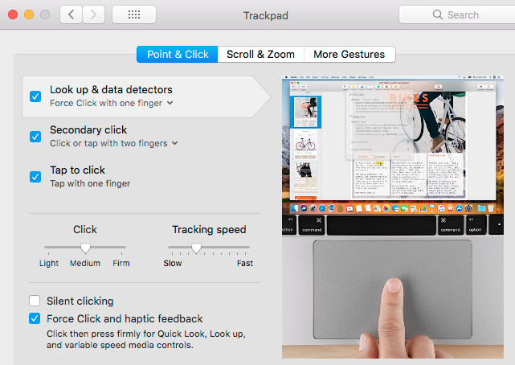
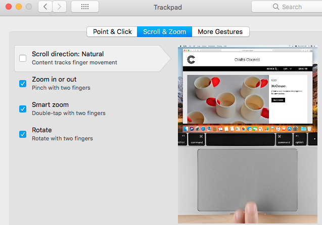
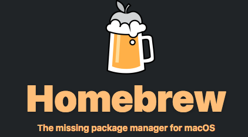
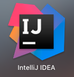

# Mac tips for developer

<!--ts-->
   * [What a developer need?](#what-needed-by-a-developer)
   * [Shortcuts](#shortcuts)
   * [Package manager](#how-to-install-packages)
   * [Editor](#editor)
   * [Terminal](#terminal-and-shell)
   * [Web browser](#web-browser)
   * [Apps](#apps)
     * [Terminal session manager](#terminal-session-manager)
     * [Screen recorder](#screen-recorder)
     * [Key capture tool](#key-capture-tool)
     * [IDE](#ide)

<!--te-->

# What needed by a developer?

- Package manager
- Editor
- Terminal + shell
- Web browser + plugins
- Good apps
- Shortcuts

# Shortcuts

|Want to | Opeartion | Userful? |
|---|---|---|
|Search anything | Type `Command`-`SPC` to use Spotlight search | +++++ |
|Kill hang tasks | Type `Option`-`Command`-`Esc` | ++++ |
|Backspace | Type `fn`-`delete` | +++ |
|Remote connect to Windows machine| use [[CoRD]](http://cord.sourceforge.net/) | +++|

## For habit

Click via a tap:



Scroll natrually:



# How to install packages?



## Install command line tool first

```shell
$ xcode-select --install
```

"gcc" and stuff will be installed automatically without whole huge xcode.

## Install brew

```shell
$ /usr/bin/ruby -e "$(curl -fsSL https://raw.githubusercontent.com/Homebrew/install/master/install)"
```

[Homebrew website](https://brew.sh/)

To install emacs, just type:

```shell
$ brew install emacs
```

# Editor

## Vimer

```shell
$ brew install macvim
```

## Emacser

```shell

$ brew install emacs --with-cocoa --with-gnutls --with-rsvg --with-imagemagick
```

- Note: if you want to learn more about Emacs, I will open another topic for it :-)

## Markdown editor

**typora** [demo](https://typora.io/img/beta.mp4)

# Terminal and shell

iterm2 + Oh-My-Zsh!

## iterm2

Download from [website](https://iterm2.com/) and install.

[iterm2 hotkeys](https://yugasun.com/post/iterm2-shortcut-key.html)

## zsh + Oh-My-Zsh!

- install zsh firstly:

```shell
$ brew install zsh
```

- install Oh-My-Zsh!

```shell
$ sh -c "$(curl -fsSL https://raw.github.com/robbyrussell/oh-my-zsh/master/tools/install.sh)"
```

# Web browser

## for chrome user
Install three plugins:
- [Vimium](https://chrome.google.com/webstore/detail/vimium/dbepggeogbaibhgnhhndojpepiihcmeb?hl=en)
- [Session Buddy](https://chrome.google.com/webstore/detail/session-buddy/edacconmaakjimmfgnblocblbcdcpbko?hl=en)
- [Dark Reader](https://chrome.google.com/webstore/detail/dark-reader/eimadpbcbfnmbkopoojfekhnkhdbieeh?hl=en)

### Hot-keys
|Want to | Opeartion | Userful? |
|---|---|---|
|Find one existing tab/page | Type `t` or `T` in chrome, input search key to filter | *** |
|Open one page which was opened before | Type `o` or `O` in chrome, input search key to filter |****|
|Open links in current page | Type `f` or `F` in chrome, type the letters in the link |****|
|Jump back to previous tab | Type `^` in chrome | *** |
|Reopen the page which is closed previously | Type `X` | ** |
|Open a new tab | Type `t` | ** |
|Close a tab | Type `x` | ** |
|Search keyword | Type `/`, like in vi, and jump to next with `n`| **** |

### To be kind to your eyes

Use plugin `Dark Reader` to switch between Dark or Light theme (I prefer Light theme).

- Original page


- Light theme


- Dark theme


### To restore your pages

Plugin `Session buddy` will do it for your automatically, even when your chrome crash.

## Firefox user
- Good news: firefox 52 and earlier can use `vimperator` plugin as `vimium` in chrome. And `session manager` is an alternative of `session buddy` in chrome.
- Bad news: `vimperator` doesn't work on firefox 52+ and newer editions.


# Apps
## Terminal session manager

Beside emacs, `tmux` is a good choice.

|Want to | Opeartion | Userful? |
|---|---|---|
|split window vertically | `C-b` `%` | **** |
|split window horizonly | `C-b` `"` | **** |
|detach tmux session | `C-b` `d` | ** |
|switch to another windows | `C-b` `o` |****|
|switch to numbered windows | ``C-b`` `w` |*****|
|show time | `C-b` `t` | ** |


## Clipboard manager

[1Clipboard](http://1clipboard.io/) should be qualified for both text and image.

- Sync among different devices via Google account.
- Simple search


## Screen recorder

[`LICEcap`](https://www.cockos.com/licecap/) is quite good.


## Key capture tool

[`KeyCastr`](https://github.com/keycastr/keycastr) is the choice.


## IDE

Intellij IDEA oracle edition. 


