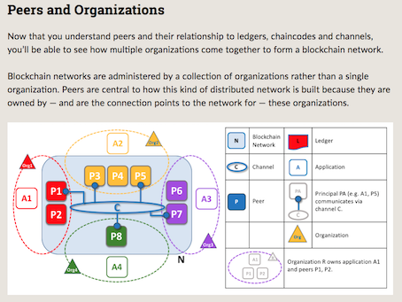
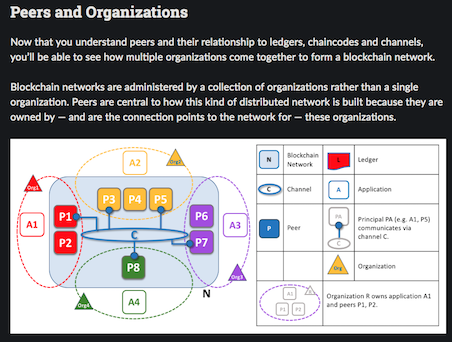

# Quick Web Surfing Tips

<!--ts-->
   * [Problems](#what-problem-these-tips-solve)
   * [Chrome user](#chrome-user)
      * [Hot-keys](#hot-keys)
      * [Kind to eyes](#to-be-kind-to-your-eyes)
      * [Restore workspace](#to-restore-your-pages)
   * [Firefox user](#firefox-user)
   * [Safari user](#safari-user)
<!--te-->

# What problem these tips solve?

- Cannot find the tab when open too many (20+) tabs in web browser
- Want to open the pages which I opened before
- Want to operate web pages without click mouse, just use keyboard, like using vi
- Want to restore my pages after computer reboot or power cycle
- Don't like the web page's color, feel eyes hurt

# Chrome user

Install three plugins:
- [Vimium](https://chrome.google.com/webstore/detail/vimium/dbepggeogbaibhgnhhndojpepiihcmeb?hl=en)
- [Session Buddy](https://chrome.google.com/webstore/detail/session-buddy/edacconmaakjimmfgnblocblbcdcpbko?hl=en)
- [Dark Reader](https://chrome.google.com/webstore/detail/dark-reader/eimadpbcbfnmbkopoojfekhnkhdbieeh?hl=en)

## Hot-keys
|Want to | Opeartion | Userful? |
|---|---|---|
|Find one existing tab/page | Type `t` or `T` in chrome, input search key to filter | *** |
|Open one page which was opened before | Type `o` or `O` in chrome, input search key to filter |****|
|Open links in current page | Type `f` or `F` in chrome, type the letters in the link |****|
|Jump back to previous tab | Type `^` in chrome | *** |
|Reopen the page which is closed previously | Type `X` | ** |
|Open a new tab | Type `t` | ** |
|Close a tab | Type `x` | ** |
|Search keyword | Type `/`, like in vi, and jump to next with `n`| **** |

## To be kind to your eyes

Use plugin `Dark Reader` to switch between Dark or Light theme (I prefer Light theme).

- Original page
| blank |
|---|
||

- Light theme

- Dark theme

## To restore your pages

Plugin `Session buddy` will do it for your automatically, even when your chrome crash.

# Firefox user
- Good news: firefox 52 and earlier can use `vimperator` plugin as `vimium` in chrome. And `session manager` is an alternative of `session buddy` in chrome.
- Bad news: `vimperator` doesn't work on firefox 52+ and newer editions.

# Safari user

No way so far :-(

# Avoid mouse-hand

